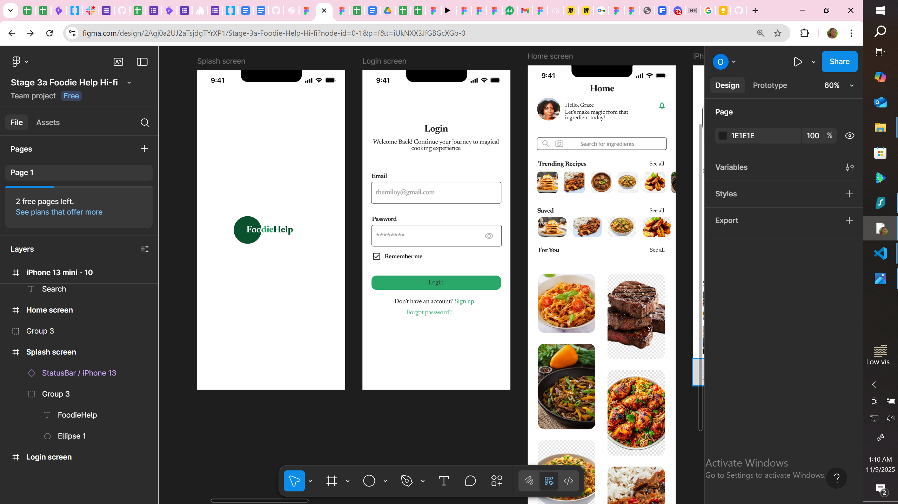

# FoodieHelp's Story for a Non-Technical Audience
## 📌 What FoodieHelp Does
Imagine going to a store to shop for groceries and you see a beetroot looking so fresh and then decide to add it to your cart, then you get home and literally have no idea what delicacy to make with it, and you know that within a few days this beetroot will go bad. You need a quick solution to this problem right? That's where FoodieHelp comes in. 

FoodieHelp allows you to search for that particular ingredient that you bought, in this case, the Beetroot, either just by typing the name in the search bar or by taking a picture of it. Then it gives you a list of meals or drinks that you can make with it and step-by-step instructions on how to make them. It doesn't end there, FoodieHelp can also help you to take a scan of other ingredients that you have in order to filter your search results to only meals that you can make with what you have, and of course, that is if you want that. 

FoodieHelp also does not restrict you to foods only available in a particular area, you have food recommendations across cultures, languages and regions, you are not restricted. Know what is more interesting? FoodieHelp also allows you to get voice guided step-by-step instructions if you would prefer that to reading the steps in the app, making you feel like you have a companion in the kitchen.

## 📎 Want to know why FoodieHelp matters?

We all have, at one point or the other gone to the market or a grocery store and have seen a nice looking Bell pepper (For people based in Nigeria where bell peppers are not an everyday available and cheap cooking ingredient), Beetroot, Broccoli, Ukazi leaf (For Non-igbo people) and so many more cooking items or ingredients, and have picked it up so excitedly to make a different meal from our everyday repetitive meals. Then we get home and have no idea what delicacy to make with it or what we need to make it delicious. 

FoodieHelp solves these problems and helps to prevent wastage of those ingredients or food items while giving people who enjoy cooking a platform to communicate with others in their shoes and  share recipes and even have cooking games and live cooking sessions. With FoodieHelp, you do not have to worry about getting that ingredient or food item you have been eyeing but could not get because you don't know what to make with it.

## 📍 Who FoodieHelp app is for:
- Females who enjoy cooking
- Males who enjoy cooking
- Females who shop for groceries
- Males who shop for groceries
- People who get tired of cooking repetitive meals

## 🔲 Key Features of FoodieHelp app
- AI camera and gallery ingredient image search
- Smart pantry synchronization
- Voice guided cooking instructions
- Group chat for chats, games and live cooking sessions
- AI recipe generation

## 🎨 Below are High Fidelity Images of the FoodieHelp App's Wireframes

.png)

.png)