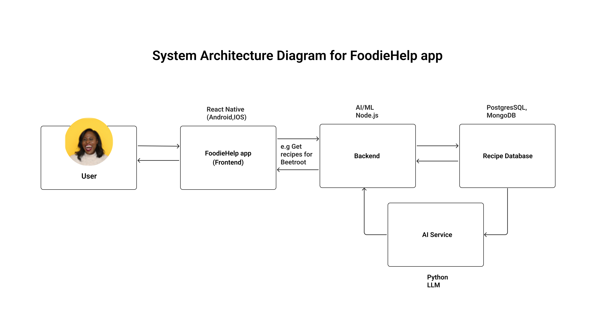

 # FoodieHelp App System Architecture Breakdown

 ## 💡 Overview
FoodieHelp app is a mobile application that helps users search for a particular hero ingredient or food item, either by text or by searching with their camera, giving the user a list of meals or consumables that can be made with the ingredient and step-by-step instructions with audio option. Users have access to group chats and smart pantry sync, giving them recommendations for recipes they can cook immediately.

The app's system is designed around a client-server architecture with integrated machine learning and database services.

The primary goal is to let users identify an ingredient (using their camera or by text) and instantly get recipes, including voice guided cooking and pantry synchronization.

## 🔆 The Key Components of the App are:
### 1. Frontend (Mobile App)

- **Stack**: React Native

- **Responsibilities of Frontend:**

  - Capturing images and sending to backend for machine learning verification.
  - Displaying recipe results, audio instructions, and group chat user interface.

### 2. Backend

- **Stack**: Node.js, Heroku

- **Responsibilities of Backend:**

  - Validating incoming requests (image/text data).

  - Querying Recipe Database and AI service to generate recipe.

  - Handling authentication, pantry synchronization logic, and group chat session management (using WebSockets).

### 3. Machine learning AI Service
- **Stack**: Python, LLM 

- **Responsibilities of Machine learning AI service:**

  - Taking the ingredient input (e.g., “Beetroot”) and querying the recipe database.

  - If the recipe options are limited, it can generate new recipe suggestions.

  - Returning the results formatted to the backend, then the backend returns the results to the frontend for UI.

### 4. Recipe Database

- **Stack**: PostgreSQL

- **Responsibilities of Recipe database:**
  - Storing curated recipes with tags (ingredients, difficulty level, time, etc).

  - Managing user's pantries and saved recipes.

  - Indexing recipes for fast search and filtering.

## 🔌 Here is How the Components Communicate

- User takes a picture of an ingredient in the Mobile App (Frontend)

- The picture is sent to the Backend then to the  Machine Learning Service for a deeper inference.

- The Machine Learning service then returns the most probable ingredient (e.g. Beetroot) to the Backend.

- The Backend then requests the ingredient (e.g. Beetroot)'s recipes from the Machine Learning AI Service or directly from the Recipe Database.

- The Mobile app then displays results with an audio cooking instructions option.

## ⚡ Why my Approach is Technically Feasible

- It is user-friendly, in the sense that simple actions lead to immediate and useful results.
- It is accurate, because the app's server can double-check difficult images.
- It is scalable, because each major function (AI service, backend, databse) can scale independently.
